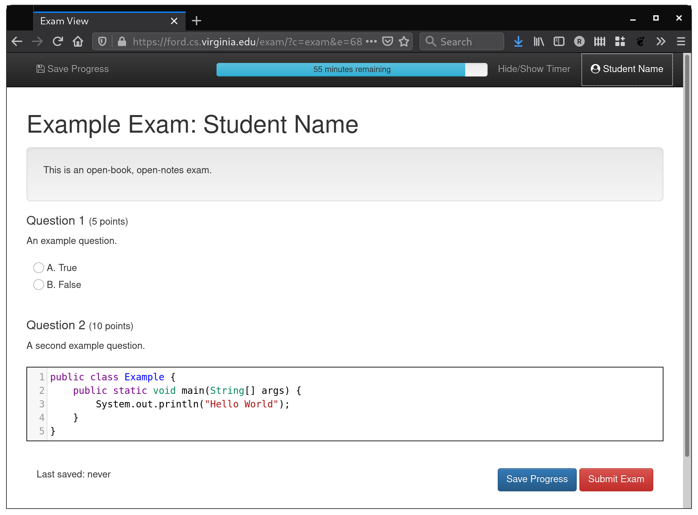

# Syntax Highlighting Exam Software

This software provides an exam interface, with support for syntax-highlighted coding, short answer, and multiple choice questions.  It supports Java, Python, and SQL coding questions and Markdown highlighting for short answer questions.

Provides grading support with autograding of multiple choice questions, preliminary support for JUnit testing of Java code, randomized assignment of submissions to graders, and grading interface that displays example solutions and rubrics along with student submissions.

The current version requires Shibboleth for authentication.
